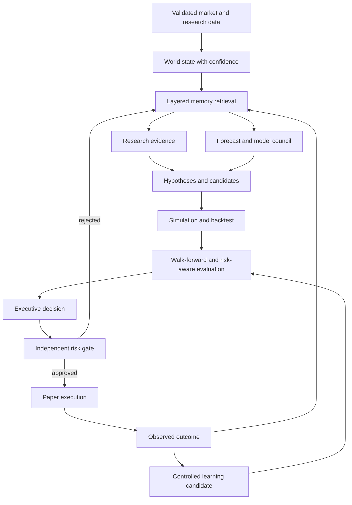
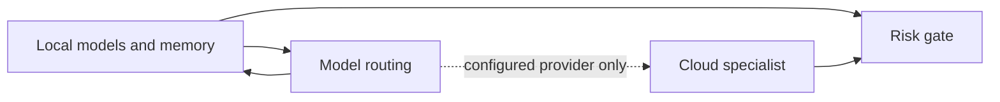

# Executive Loop



The `ExecutiveBrain` cannot send an order around `RiskEngine`. Model and research outputs remain evidence, not authority. `PromotionGate` requires explicit governance approval even after a candidate has passed automated checks.



Cloud is shown as a conditional path because it is not enabled in the default configuration.

## Agent-kernel loop (added Phase 31E)

The 16-phase executive loop above is the **brain**. The
agent kernel is a separate, much smaller loop, also
deterministic, that the brain (or any other policy) can
call when it wants the system to *act on the capability
registry* rather than just *read* it.

```mermaid
flowchart LR
    Obs[Observation] --> Step[Agent.step]
    Step --> Resolve[Resolve pending action into ActionOutcome]
    Resolve --> Beliefs[Update beliefs / episodic memory]
    Beliefs --> Policy[policy(ctx) -> Action]
    Policy --> Exec[CapabilityExecutor.execute]
    Exec --> Result[CapabilityResult]
    Result --> Self[Update self-model]
    Result --> Step
    Step --> State[New WorldState]
```

The two loops are independent:

* The 16-phase loop runs **once per cycle** on a market
  observation and produces a decision.
* The agent-kernel loop runs **as many times as needed**
  on a sequence of observations and produces a stream of
  actions against the capability registry.

The kernel is the **runtime**; the executive is the **policy**
when it chooses to act through capabilities. See
[PHASE_31E_AUDIT.md](PHASE_31E_AUDIT.md) for the full design
and the 14 things the kernel *does not* include.
