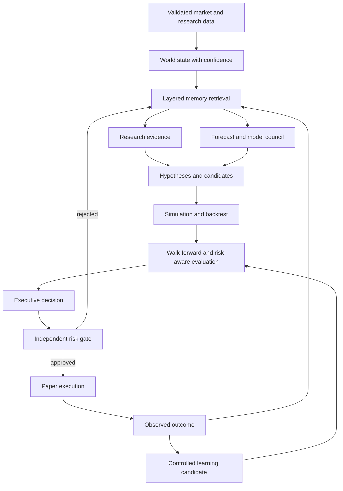
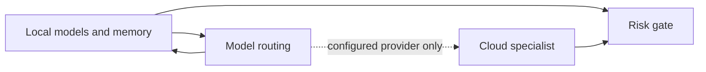

# Executive Loop

The `ExecutiveBrain` cannot send an order around `RiskEngine`. Model and research outputs remain evidence, not authority. `PromotionGate` requires explicit governance approval even after a candidate has passed automated checks.

Cloud is shown as a conditional path because it is not enabled in the default configuration.
